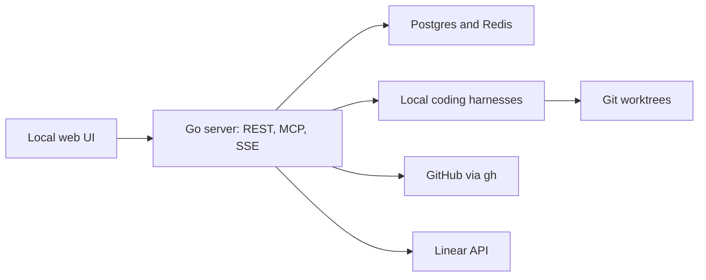

# Flywheel

**A local control plane for coding agents.** Define workers, assign them to tasks, and follow the work from a ticket or pull request through to a running session.

Flywheel runs on your machine alongside **Claude Code**, **Codex**, **GitHub**, and **Linear**. It coordinates their work rather than replacing your editor, Git hosting, issue tracker, or the harnesses themselves. It is a personal project under active development, built for one trusted operator—not a hosted, multi-user service.

## What you can do

- **Define workers once.** Keep a worker's harness, model, reasoning effort, and standing instructions together. Assign it to reviews, implementation, planning, or individual workflow steps.
- **Build workflows.** Start from a template, save a reusable workflow, and customize it for a project. Combine agent steps, external integrations, actions, and human approval gates.
- **Review pull requests.** Paste a PR URL or enable review-request watchers. Inspect findings, discuss them with the reviewer, retry an attempt, or stop watching a PR. Publishing to GitHub is optional.
- **Dispatch ticket work.** Mirror Linear projects and issues, then run implementation workers in managed Git worktrees.
- **Plan with the orchestrator.** Discuss a change in a project's command center before turning it into implementation work.
- **Follow live work.** The global tray shows active dispatchers and reviewers, links to their tickets, PRs, and sessions, and decisions that need your attention. Updates arrive over SSE.

## Run locally

### Prerequisites

- Go matching [go.mod](go.mod) (currently 1.26.1).
- Node.js 22.12 or newer and npm; [.nvmrc](.nvmrc) selects Node 22.
- Docker with Compose v2, running.
- The [`migrate` CLI](https://github.com/golang-migrate/migrate/tree/master/cmd/migrate).
- Python 3 for initial configuration and the browser-test fixtures.
- At least one supported coding harness installed and authenticated to run agent tasks.
- The authenticated [`gh` CLI](https://cli.github.com/) for GitHub reviews and PR operations. Linear is optional until you want ticket sync.

```bash
git clone https://github.com/gabinante/flywheel.git
cd flywheel
make dev
```

`make dev` checks prerequisites, creates a private `.env` with a random callback-signing secret if none exists, starts Postgres and Redis, applies migrations, builds the frontend, and runs the Go server in the foreground. It does not overwrite existing settings or stop an already-running Flywheel instance.

Open **[localhost:8090](http://localhost:8090)**. There is no login page: startup provisions the local workspace. On a fresh setup, the example configuration leaves dispatch and review watchers off, so connecting your tools does not immediately launch background work.

| Service | Local address |
|---|---|
| Web UI, REST, and MCP | `127.0.0.1:8090` |
| Postgres | `127.0.0.1:5439` |
| Redis | `127.0.0.1:6389` |

The database credentials in Compose are **local development defaults**, not production credentials. Keep these services on loopback. Flywheel is not designed to be exposed to the internet.

### First steps

1. Open **Workers → Harness connections** and check the installed harnesses and their login status.
2. Add a worker with the model and instructions you want, then save it.
3. Choose workers under **Task assignments**, or select one in a workflow step.
4. For PR reviews, enable Code review in Settings and paste a URL into My Reviews. Keep **Publish reviews to GitHub** off while trying it out.
5. For ticket work, connect Linear in Settings, link a project and its repository, customize its workflow, then enable dispatch when ready.

Repository checkouts default to `~/git`. Review and implementation worktrees live alongside those checkouts. Existing operator settings are persisted in Postgres and override the initial environment defaults; edit them in the UI once the app is set up.

## Development

```bash
make dev-infra          # Postgres and Redis only
make migrate           # Use the database configured through varlock
make web-build         # Install locked frontend dependencies and build
make build             # Write bin/flywheel-server
make run               # Run the Go server from source
```

Run the compiled server from the repository root with `./scripts/varlock run -- ./bin/flywheel-server` so it can find `web/dist`. Stop a foreground server with Ctrl-C; `make dev-stop` explicitly stops the listener on port 8090. `make docker-down` stops infrastructure without deleting its volume.

For frontend hot reload, run `npm ci && npm run dev` inside `web/`. Vite serves on port 5173 and proxies API requests to Flywheel. Alternatively, start the Go server with `WEB_DEV_PROXY_URL=http://127.0.0.1:5173` to browse through port 8090.

After changing [api/openapi.yaml](api/openapi.yaml), run `make generate` and `npm --prefix web run gen:api`. The Go generator requires `oapi-codegen` on your PATH.

## Tests

```bash
make test
npm --prefix web test
npm --prefix web run lint
npm --prefix web run build

# Install Playwright's Chromium once, then run the isolated integration suite.
(cd web && npx playwright install chromium)
./scripts/test-hardening.sh

# Install Gitleaks, then scan tracked files and all local Git refs.
make secret-scan
```

The browser suite builds the app and uses disposable Postgres/Redis containers, fake GitHub responses, and actual local fake-harness processes on port **8091**. It must not run against your live workspace. Some acceptance tests document unfinished features as expected failures; see the [journey catalog](docs/testing/core-user-journeys.md) and [UI audit](docs/testing/ui-ux-audit-2026-09-08.md).

## How it fits together



| Area | Code |
|---|---|
| Server, API contract, and handlers | `cmd/server`, `api/` |
| Workflow engine and dispatch | `internal/workflow`, `internal/dispatch` |
| PR reviews and feedback | `internal/codereview`, `internal/harness` |
| Workers and runtime settings | `internal/settings`, `internal/project` |
| Sessions, progress, and live updates | `internal/sessions`, `internal/runstatus`, `internal/activity`, `internal/overview` |
| React frontend | `web/` |
| Database schema | `db/migrations/` |

Further reading: [Workers](docs/workers.md), [SSE activity](docs/activity-stream.md), [REST and MCP](docs/interacting.md), [security and credential handling](SECURITY.md), and [contributing](CONTRIBUTING.md).

## License

Source available under the [Business Source License 1.1](LICENSE), with the change date and change license specified there. Publishing the source does not change those terms.
